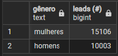
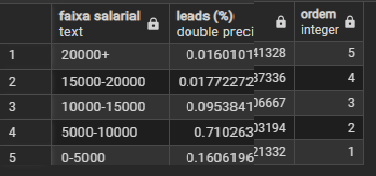
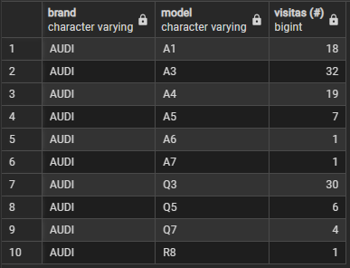

Este projeto faz parte do curso [SQL para Análise de Dados](https://www.udemy.com/course/sql-para-analise-de-dados/learn/lecture/30132486#overview).

Em cada curso temos um estudo de caso com apresentação do cenário, os problemas e os dados para desenvolver projetos em SQL.

## Introdução

Danny adora comida japonesa e, no início de 2021, decidiu abrir um restaurante vendendo seus 3 pratos favoritos: sushi, curry e ramen.

O **Danny's Diner** precisa da sua ajuda para utilizar os dados coletados nos primeiros meses de operação a fim de entender melhor seus clientes e administrar o negócio com mais eficiência.

---

## Objetivo

 - Criar um Dashboard de Vendas com os principais indicadores de desempenho e drivers com os resultados do Mês.
 - Analisar as principais caracteristicas dos leads que visitam nosso E-commerce

## Problema

Utilizar os dados disponíveis do E-commerce para responder as perguntas-chave como:

- Evolução da receita e o ticket médio dos veículos comprados no E-commerce?
- Qual a conversão de leads para contrato pago(venda)?
- Quais os Estados com o maior número de Vendas?
- Quais as marcas mais vendidas?
- Quais as loja que mais venderam?
- Qual o dia com maior volume de visitas em nosso site?
- Qual o perfil dos nossos clientes?
- Qual o interesse dos Leads em nosso site?


Com essas informações, Danny pretende:

- Acompanhar o crescimento mensal, acompanhar o ticket médio;
- Verificar o funil de Vendas - Leads x Taxa de conversão;
- Criar campanhas de marketing segmentadas para cada Estado;
- Parceria com as lojas e marcas para alavancar as vendas;
- Ações de marketing nos dias que temos mais visitas em nosso site;
- Identificar o perfil dos nossos clientes através do gênero, faixa etária,faixa salaria, status profissional;
- Conseguir analisar a classificação dos veículos (novos,semi-novos ou antigos;
- Modelos mais buscados;
- Marcas mais buscadas;

---

## Conjuntos de Dados

A condução da análise foi realizada com PostgreSQL utilizando o PgAdmin.

Os scipts de criação e inserção de dados estão no arquivo [tabelas.sql](./tabelas.sql).

O estudo utiliza 2 tabelas principais:

### Tabela `sales`

stores - Contém Dados das lojas
 - **store_id**   :identificador da loja
 - **store_cnpj** :CNPJ da loja
 - **store_name** :nome da loja

products -Contém Dados dos produtos
 - **product_id**  :identificador do produto
 - **brand**       :marca do produto
 - **model**       :modelo do produto
 - **model_year**  :ano do modelo
 - **price**       :preço do produto

 funnel - Contem Dados dos acessos ao site(e-commerce)
 - **visit_id**    		:identificador da visita
 - **customer_id** 		:identificação cliente
 - **store_id**    		:identificar da loja
 - **product_id**  		:identificador do produto
 - **visit_page_date** 		:data da visita ao site
 - **add_to_cart_date** 	:data adicionada ao carrinho de compra
 - **start_checkout_date** 	:data do incio da compra
 - **finish)checkout_date** 	:data do fim da compra
 - **paid_date**	 	:data do pagamento(compra efetiva)
 - **distount**		 	:desconto

 customers -Contém Dados dos clientes
 - **customer_id** 	   :identificação cliente
 - **cpf**    		   :CPF do cliente
 - **first_name**  	   :primeiro nome do cliente
 - **last_name**  	   :sobrenome do cliente
 - **city** 		   :cidade do cliente
 - **state** 		   :estado do cliente
 - **birth_date** 	   :data do nascimento
 - **income**	 	   :renda do cliente
 - **score**		   :pontuação do cliente
 - **professional_status** :status profissional do cliente
 - **email**               : email do cliente
 - **mobile**		   : telefone do cliente


### Tabela `temp_tables

ibge_genders - Contém dados demograficos
 -**first_name**: Nome cliente
 -**gender**    : Gênero do cliente

regions - Contém dados demograficos
 -**city**	 :cidade
 -**state**      :estado
 -**region**     :região
 -**size**	 :tamanho
 -**code**	 :CEP
 -**population** :total população

tabela_1
- cpf
- name

tabela_2
- cpf
- state

product_2
- product_id
- brand
- model
- model_year
- price

Diagrama ER


---


## Análises

Os scripts das análises podem ser acessados no arquivo [analises.sql](./analises.sql).


- Qual o total de Leads?
> 
```sql

select
	date_trunc('month', visit_page_date):: date as visit_page_month,
	count(*) as Total_de_Visitas

from sales.funnel
group by visit_page_month
order by visit_page_month

```


- Qual o total de Vendas e o Valor da Receita?
> 
```sql

select
	date_trunc('month', fun.paid_date)::date as paid_month,
	count(fun.paid_date) as paid_count,
	sum(pro.price * (1+fun.discount)) as receita


from sales.funnel as fun
left join sales.products as pro
	on fun.product_id = pro.product_id
where fun.paid_date is not null
group by paid_month
order by paid_month
	

```


- Qual a taxa de conversão e a taxa do Ticket Médio?
> 
```sql

with
   leads as (
	select
	date_trunc('month', visit_page_date):: date as visit_page_month,
		count(*) as visit_page_count
	from sales.funnel
	group by visit_page_month
	order by visit_page_month
	),
payments as (
	select
	date_trunc('month', fun.paid_date)::date as paid_month,
	count(fun.paid_date) as paid_count,
	sum(pro.price * (1+fun.discount)) as receita

from sales.funnel as fun
left join sales.products as pro
	on fun.product_id = pro.product_id
where fun.paid_date is not null
group by paid_month
order by paid_month
)

select
	leads.visit_page_month as "Mês",
	leads.visit_page_count as "Leads",
	payments.paid_count as "Vendas",
	(payments.receita/1000) as "Receita",
	(payments.paid_count::float/leads.visit_page_count::float) as "Conversão",
	(payments.receita/payments.paid_count/1000) as "Ticket Médio"
	
from leads
left join payments
on leads.visit_page_month = paid_month

```


- Estados que mais venderam?
> 
```sql
select
	'Brazil' as país,
	cus.state as estado,
	count(fun.paid_date) as "vendas (#)"

from sales.funnel as fun
left join sales.customers as cus
	on fun.customer_id = cus.customer_id
where paid_date between '2021-08-01' and '2021-08-31'
group by país, estado
order by "vendas (#)" desc


```


- Marcas que mais venderam?
> 
```sql
select
	pro.brand as marca,
	count(fun.paid_date) as "vendas (#)"

from sales.funnel as fun
left join sales.products as pro
	on fun.product_id = pro.product_id
where paid_date between '2021-08-01' and '2021-08-31'
group by marca
order by "vendas (#)" desc
limit 10

```


- Lojas que mais venderam?
> 
```sql

select
	sto.store_name as loja,
	count(fun.paid_date) as "vendas (#)"

from sales.funnel as fun
left join sales.stores as sto
	on fun.store_id = sto.store_id
where paid_date between '2021-08-01' and '2021-08-31'
group by loja
order by "vendas (#)" desc
limit 10

```


- Qual o dia da semana com maior volume de visitas em nosso site?
> 
```sql
select
	extract('dow' from visit_page_date) as dia_semana,
	case 
		when extract('dow' from visit_page_date)=0 then 'domingo'
		when extract('dow' from visit_page_date)=1 then 'segunda'
		when extract('dow' from visit_page_date)=2 then 'terça'
		when extract('dow' from visit_page_date)=3 then 'quarta'
		when extract('dow' from visit_page_date)=4 then 'quinta'
		when extract('dow' from visit_page_date)=5 then 'sexta'
		when extract('dow' from visit_page_date)=6 then 'sábado'
		else null end as "dia da semana",
	count(*) as "visitas (#)"

from sales.funnel
where visit_page_date between '2021-08-01' and '2021-08-31'
group by dia_semana
order by dia_semana

```


- Gênero dos Leads?

> 
```sql
select
	case
		when ibge.gender = 'male' then 'homens'
		when ibge.gender = 'female' then 'mulheres'
		end as "gênero",
	count(*) as "leads (#)"

from sales.customers as cus
left join temp_tables.ibge_genders as ibge
	on lower(cus.first_name) = lower(ibge.first_name)
group by ibge.gender


```




- Status Profissional dos Leads?

> 
```sql
select
	case
		when professional_status = 'freelancer' then 'freelancer'
		when professional_status = 'retired' then 'aposentado(a)'
		when professional_status = 'clt' then 'clt'
		when professional_status = 'self_employed' then 'autônomo(a)'		
		when professional_status = 'other' then 'outro'
		when professional_status = 'businessman' then 'empresário(a)'
		when professional_status = 'civil_servant' then 'funcionário(a) público(a)'
		when professional_status = 'student' then 'estudante'
		end as "status profissional",
	(count(*)::float)/(select count(*) from sales.customers) as "leads (%)"

from sales.customers
group by professional_status
order by "leads (%)"


```


- Faixa Etária dos Leads?

> 
```sql
SELECT
  CASE
    WHEN EXTRACT(YEAR FROM AGE(current_date, birth_date)) < 20 THEN '0-20'
    WHEN EXTRACT(YEAR FROM AGE(current_date, birth_date)) < 40 THEN '20-40'
    WHEN EXTRACT(YEAR FROM AGE(current_date, birth_date)) < 60 THEN '40-60'
    WHEN EXTRACT(YEAR FROM AGE(current_date, birth_date)) < 80 THEN '60-80'
    ELSE '80+'
  END AS "faixa etária",
  COUNT(*)::float / (SELECT COUNT(*) FROM sales.customers) AS "leads (%)"
FROM sales.customers
GROUP BY "faixa etária"
ORDER BY "faixa etária" DESC;

```


- Faixa Salarial dos Leads?

> 
```sql
select
	case
		when income < 5000 then '0-5000'
		when income < 10000 then '5000-10000'
		when income < 15000 then '10000-15000'
		when income < 20000 then '15000-20000'
		else '20000+' end "faixa salarial",
		count(*)::float/(select count(*) from sales.customers) as "leads (%)",
	case
		when income < 5000 then 1
		when income < 10000 then 2
		when income < 15000 then 3
		when income < 20000 then 4
		else 5 end "ordem"

from sales.customers
group by "faixa salarial", "ordem"
order by "ordem" desc


```



- Classificação dos veículos?

> 
```sql
with
	classificacao_veiculos as (
	
		select
			fun.visit_page_date,
			pro.model_year,
			extract('year' from visit_page_date) - pro.model_year::int as idade_veiculo,
			case
				when (extract('year' from visit_page_date) - pro.model_year::int)<=2 then 'novo'
				else 'seminovo'
				end as "classificação do veículo"
		
		from sales.funnel as fun
		left join sales.products as pro
			on fun.product_id = pro.product_id	
	)

select
	"classificação do veículo",
	count(*) as "veículos visitados (#)"
from classificacao_veiculos
group by "classificação do veículo"

```


- Idade dos veículos?

> 
```sql
with
	faixa_de_idade_dos_veiculos as (
	
		select
			fun.visit_page_date,
			pro.model_year,
			extract('year' from visit_page_date) - pro.model_year::int as idade_veiculo,
			case
				when (extract('year' from visit_page_date) - pro.model_year::int)<=2 then 'até 2 anos'
				when (extract('year' from visit_page_date) - pro.model_year::int)<=4 then 'de 2 à 4 anos'
				when (extract('year' from visit_page_date) - pro.model_year::int)<=6 then 'de 4 à 6 anos'
				when (extract('year' from visit_page_date) - pro.model_year::int)<=8 then 'de 6 à 8 anos'
				when (extract('year' from visit_page_date) - pro.model_year::int)<=10 then 'de 8 à 10 anos'
				else 'acima de 10 anos'
				end as "idade do veículo",
			case
				when (extract('year' from visit_page_date) - pro.model_year::int)<=2 then 1
				when (extract('year' from visit_page_date) - pro.model_year::int)<=4 then 2
				when (extract('year' from visit_page_date) - pro.model_year::int)<=6 then 3
				when (extract('year' from visit_page_date) - pro.model_year::int)<=8 then 4
				when (extract('year' from visit_page_date) - pro.model_year::int)<=10 then 5
				else 6
				end as "ordem"

		from sales.funnel as fun
		left join sales.products as pro
			on fun.product_id = pro.product_id	
	)

select
	"idade do veículo",
	count(*)::float/(select count(*) from sales.funnel) as "veículos visitados (%)",
	ordem
from faixa_de_idade_dos_veiculos
group by "idade do veículo", ordem
order by ordem


```


- Veículos mais visitados em nosso site por marca/modelo?

> 
```sql
select
	pro.brand,
	pro.model,
	count(*) as "visitas (#)"

from sales.funnel as fun
left join sales.products as pro
	on fun.product_id = pro.product_id
group by pro.brand, pro.model
order by pro.brand, pro.model, "visitas (#)"
limit 10


```




## Relatório

Ao analisar os padrões de consumo dos clientes no restaurante, podemos destacar os pontos a seguir.

Despesas e Frequência de Visitas:

-
-
-
-


Esses insights, ao serem considerados de forma integrada, oferecem uma visão abrangente das dinâmicas no restaurante, proporcionando orientação valiosa para estratégias futuras e aprimoramento da experiência do cliente.